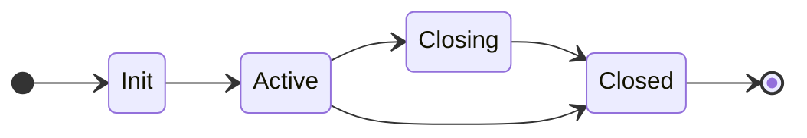
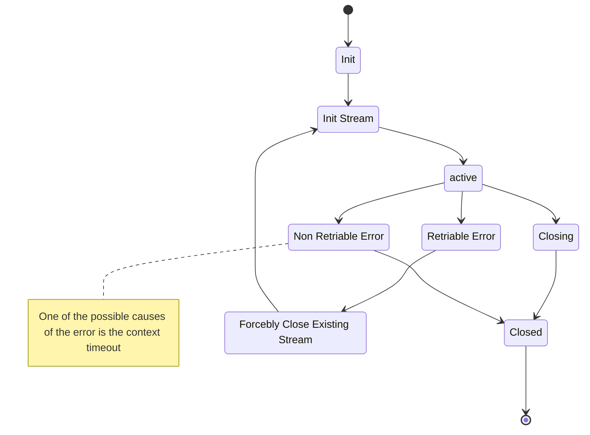

# YDB Query Service client

## Experimental

Notice: This API is EXPERIMENTAL and may be changed or removed in a later release.

# TODO

- Make required fields in arguments, and readonly result
- Retryer
- Promise like streams wrappers
- Update auth token on streams
- Compression
- Transactions
- Add context
- Graceful shutdown

# State machine

## Stream

## Retryer

